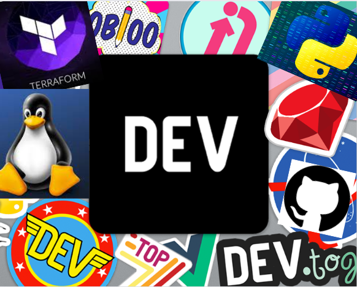

## Hi 👋, I am Tanushree! :woman_technologist:
An application support professional, passionate about Cloud :cloud: and DevOps !

## My Current Tech Stack
- AWS
- Terraform
- Linux
- Python
- Git
- Docker

## Articles on Dev.to

Check out my articles on [dev.to](https://dev.to/tanushree_aggarwal) :cloud: :open_book: :pencil2:

- [Scheduling EC2 start and stop using Eventbridge and Lambda (part...](https://dev.to/aws-builders/scheduling-ec2-start-and-stop-using-eventbridge-and-lambda-part-1-of-2-30he) - 13/09/2023
- [Restricting access through IAM policies](https://dev.to/aws-builders/restricting-access-through-iam-policies-3p0o) - 31/08/2023

<table>
        <tr>
            <td width="300px"></td>
            <td>
                <a href="https://dev.to/aws-builders/scheduling-ec2-start-and-stop-using-eventbridge-and-lambda-part-1-of-2-30he">Scheduling EC2 start and stop using Eventbridge and Lambda (part...</a>
                
Introduction:   By now we understand very well that: Cloud == Pay for what you use One of...

                
<i>13/09/2023</i>

            </td>
        </tr>
        <tr>
            <td width="300px"></td>
            <td>
                <a href="https://dev.to/aws-builders/restricting-access-through-iam-policies-3p0o">Restricting access through IAM policies</a>
                
Introduction :            Goal :    To understand principle of least privilege.  Understand...

                
<i>31/08/2023</i>

            </td>
        </tr>
</table>
